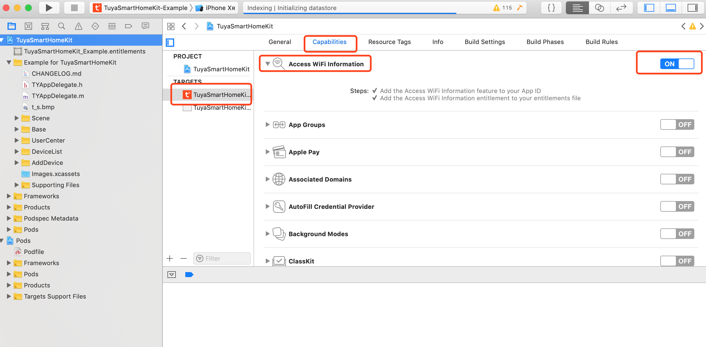

# FAQ

**1. Why are errors reported in running the `pod install` ?** 

   - Please confirm that the latest version cocoapod is used. Run the `pod --version` command to check the version of pod, and ensure that the version 1.3.0 or beyond is used. 

**2. Why the `"Error Domain=NSURLErrorDomain Code=-999 is canceled"` error is reported when invoking the SDK interface?** 

   - Please conform that the object you request is a global variable, or the it will be released early, for example, `self.feedBack = [[TuyaSmartFeedback alloc] init]`;

**3. How to enable the debugging mode and print logs?** 

  - Invoke the following codes: `[[TuyaSmartSDK sharedInstance] setDebugMode:YES];` when the SDK is initiated. 

**4. The device  do not report the status when the control instruction is sent.** 

  - Please check the data type of function points. For example, the data type of function points shall be value, and the @{@"2": @(25)} instead of @{@"2": @"25"} shall be sent for the control command.

**5. In iOS 12, `[[TuyaSmartActivator sharedInstance] currentWifiSSID]` can't get ssid.**

   - Xcode 10 should open `access wifi information` capability to get ssid. This can be found at:
       `Xcode` -> [Project Name] -> `Targets` -> [Target Name] -> `Capabilities` -> `Access WiFi Information` -> `ON`

   

**6. After update sdk to version >=2.8.0, app crashed immediately after sdk init.**

After SDK 2.8.0, we have added security image check and use the new appkey/secret. Please refer to [Preparation work](./Preparation.md) section and go to tuya iot platform to get the appkey/secret/security image which is required by sdk init.

**7. sdk demo compile failed: `library not found for -XXX**

- Confirm you open the `.xcworkspace` instead of `.xcproject`. See: [CocoaPods Guides](https://guides.cocoapods.org/)

**8. iOS 13 Adaptation**

- See: [iOS 13 Adaptation](./iOSAdaptation.md)

**9. Why does the SDK obtain that the local language is English, rather than the language of the mobile phone system?**

- Because the SDK is based on the local language obtained from  [[NSBundle mainBundle] preferredLocalizations], you need to create an international language in the project.

**10. Does the SDK support infrared device control?**

- Now TuyaSmartHomeKit SDK does not support infrared device control

**11. Why did the device control send multiple function points (DPS) and did not receive all data function point responses?**

- When the device controls the transmission of multiple functions, it is necessary to first determine whether there is a conflict between the function points. For example, for lighting devices, the brightness of the light and the function points of heating and cooling can be put together to send.
- However, when the switch, brightness and temperature are put together, there will be some problems that the function points do not respond.
-  Therefore, it is recommended to send the function without function conflict together.

**12. If there is no Bluetooth function, can you reduce the package size without relying on the SDK Bluetooth module?**

- Yes, you can only rely on the following two modules for device distribution and control functions

```ruby
# home management, device, room, group management related functions
pod 'TuyaSmartDeviceKit',
# Relevant functions of device activator
pod 'TuyaSmartActivatorKit',
```

- The following modules can be referenced according to actual needs

```ruby
# Single point Bluetooth related functions
pod 'TuyaSmartBLEKit', 
# Sigmesh related functions
pod 'TuyaSmartBLEMeshKit',
# Intelligent scene related functions
pod 'TuyaSmartSceneKit', 
# device and group timing related functions
pod 'TuyaSmartTimerKit',
# Message center related functions
pod 'TuyaSmartMessageKit',
# Fault feedback related functions
pod 'TuyaSmartFeedbackKit',
```

**14. iOS sdk build error `Undefined symbols xxx`**  

* Generally, due to the version of sdk referenced is different, it's need confirmed whether each library referenced is a unified version (for example: 3.12.1, 3.12.5..), if not, `pod update` and recompiling.

**15. Xcode 11 not included application loader**

* `Application Loader` is no longer included with Xcode 11. `Transporter` tool announced that replaces Application Loader.

**16. Signature check error**

* Please check the `bundleId`、`appKey`、`appSecret`、`Security img`, any one of the mismatches will fail the verification. Please refer to [Preparation work](./Preparation.md) section

**17. `pod install` failed with "CDN: trunk Repo update failed / trunk URL couldn't be downloaded"**

- CocoaPods 1.8.0 use CDN Repo as default，if you failed to connect it for network issue, please use Master Repo instead. Edit `Podfile` and set Master Repo as primary source:

  ```diff
  - source 'https://cdn.cocoapods.org/'
  + source 'https://github.com/CocoaPods/Specs.git'
  ```

- Detail: http://blog.cocoapods.org/CocoaPods-1.8.0-beta/


