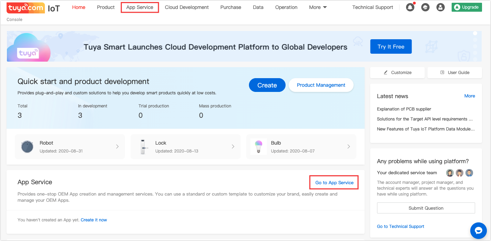
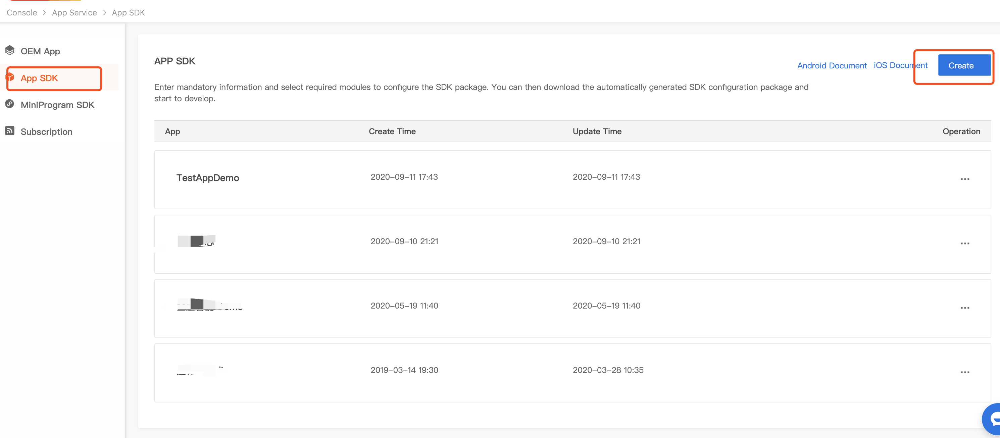
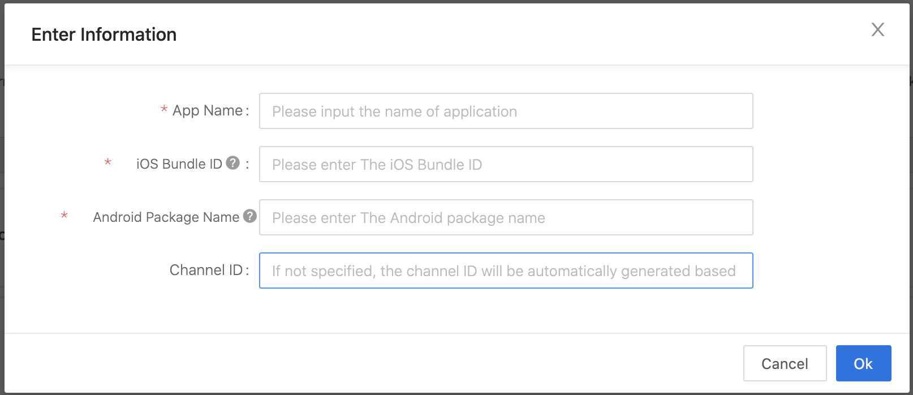
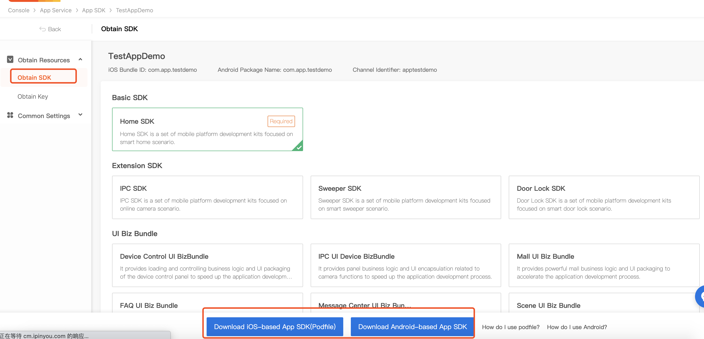
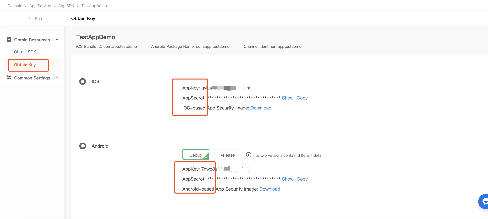

## Preparation for Integration

### Register Tuya Developer Account

Go to the [Tuya Smart Development Platform](https://iot.tuya.com) to register a developer account, create products and create function points, etc. Please refer to the [Contact workflow](https://docs.tuya.com/cn/overview/dev-process.html) for details. 

###  Create an SDK APP

1.Log in to [IoT Console](https://iot.tuya.com/).

   **Note**: if you do not have a Tuya account, register first.

2.On the menu bar at the top of the **IoT Console**, click **App Service**.

   

3.Select **App SDK**, and click **Create**.

4.Enter app related information, and then click **OK**.

- **App name**: enter the App name.
- **iOS Bundle ID**: enter the iOS app bundle ID. The recommended format is com.xxxxx.xxxxx.
- **Android Package Name**: enter the Android app package name. It is not necessary to be consistent with iOS bundle ID.
- **Channel ID**: it is not required. If it is not entered, the system will automatically generate one channel ID according to the package name.

5.You can choose the option you need according to actual needs, support multiple selections, and then integrate the SDK according to Podfile and Gradle.

6.Click **Obtain Key** to get SDK AppKey, AppSecret, security picture and other information.

