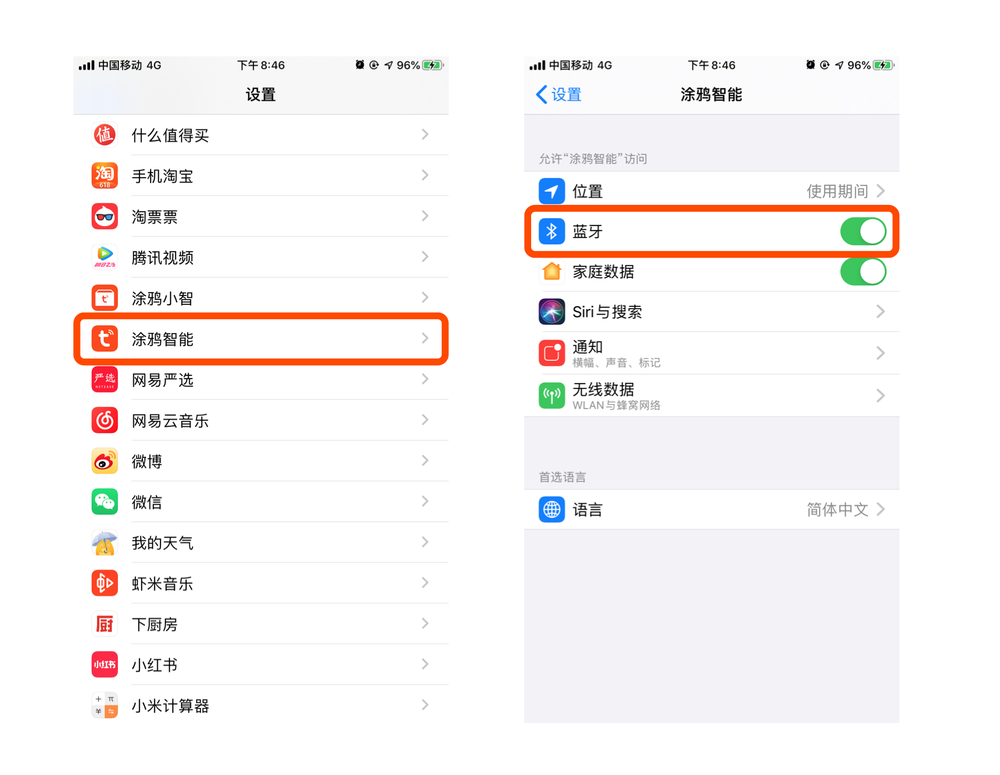

## TuyaSmartHomeKit iOS 版本适配

### iOS 13 适配

- Wi-Fi 权限变化

   从 iOS 13 开始，如果没有开启地理位置权限，`[[TuyaSmartActivator sharedInstance] currentWifiSSID]` 将获取不到正确的 SSID （在第已开启 Wi-Fi 权限的前提下）,  在此情况下，系统会默认返回 WLAN or Wi-Fi，以下是 Apple 的官方邮件说明
   
   ```
   As we announced at WWDC19, we're making changes to further protect user privacy and prevent unauthorized location tracking. Starting with iOS 13, the CNCopyCurrentNetworkInfo API will no longer return valid Wi-Fi SSID and BSSID information. Instead, the information returned by default will be: 
   
   SSID: “Wi-Fi” or “WLAN” (“WLAN" will be returned for the China SKU)
   BSSID: "00:00:00:00:00:00"
   ```
   
   1. 确认 app 已开启地理位置权限
   2. 确认通过系统方法获取的 BSSID 为 00:00:00:00:00:00 则认为是系统的默认返回，该结果不可用，需要开发者另外处理，比如手动输入 Wi-Fi 名称


- 蓝牙权限变化

   如果您有使用 SDK 开发集成涂鸦蓝牙设备，那么一定要关注 iOS 13 新增的「应用蓝牙权限」
   在 iOS 13 系统中，除了系统蓝牙权限外，每个 APP 都会有自己的蓝牙权限。若 app 中使用到蓝牙，每个应用首次启动前都会询问**是否允许应用使用蓝牙权限**

   **如果您正在 Xcode 11 编译使用 SDK 开发 mesh 功能，可能会出现搜索不到设备的情况。需要将 `TuyaSmartBLEMeshKit` 升级至 2.12.47 以上版本，该版本已作适配；若使用其他 Xcode 版本，无需更新**

   当用户选择不允许时，会影响蓝牙功能的使用。此时建议引导用户进行开启蓝牙权限（此时蓝牙中心的状态为 `CBCentralManagerStateUnauthorized`）
   

### iOS 12 适配

iOS 12 使用 `[[TuyaSmartActivator sharedInstance] currentWifiSSID]` 无法获取到SSID

在 Xcode10 中获取WiFi信息需要开启相关权限，解决方案：

- `Xcode` -> [Project Name] -> `Targets` -> [Target Name] -> `Capabilities` -> `Access WiFi Information` -> `ON`

打开上述权限即可。

